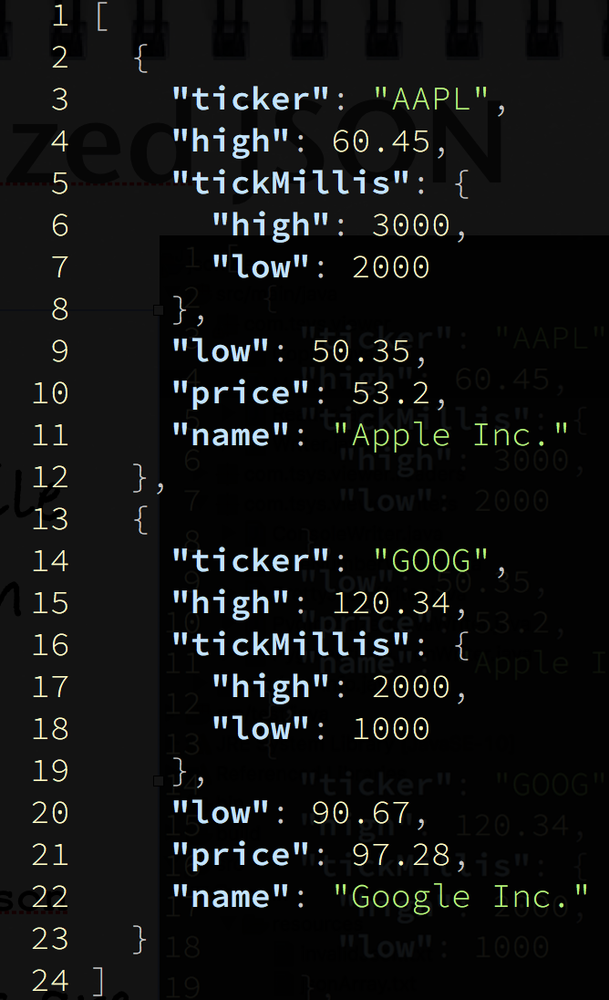

# JSON Viewer Refactoring Problem

## Example Usage
* ```prettyjson -l response.json```
<center>
  
</center>
* Default behavior is to print pretty JSON which is indented and colorized.
* General Command ```prettyjson [-r] [-l] [-h] [-v] [-nc] <file>```
* Options:
  * ```h```: Show this help message.
  * ```v```: Show version info.
  * ```r```: Show raw Json file (as-is un-indented).
  * ```l```: Print Line numbers in the output.
  * ```nc```: Turn colorizing off. 

## Creating Eclipse and Idea Project files, Building and Running.

* To create project Eclipse Project files, run ```gradle eclipse``` 
* To create project Idea Project files, run ```gradle idea``` 
* To build the project execute ```gradle``` 
* To run the project execute ```gradle run``` 

#### Using Other languages like Scala, Groovy, Clojure
* You can appropriately add the gradle plugins as per your choice of language in the ```build.gradle```.
* Do not forget to delete ```java``  plugin found therein.

### Running
When you run this, it invokes, application main class, which just prints usage as:
```usage: prettyjson <file> [-h] [-l] [-r] [-v]```

### Unzip and Run
You can unzip the zip generated in the distribution as follows:

```shell
$> gradle
$> unzip ./build/distributions/prettyjson-1.0-SNAPSHOT.zip
$> ./prettyjson-1.0-SNAPSHOT/bin/prettyjson -h

usage: prettyjson <file> [-h] [-l] [-r] [-v]
Pretty JSON formatter
 -h,--help      print this message
 -l,--lines     Show line numbers
 -r,--raw       Show JSON as received

$> ./prettyjson-1.0-SNAPSHOT/bin/prettyjson ./src/main/resources/nestedJsonObject.txt

{
  "ticker": "AAPL",
  "high": 60.45,
  "tickMillis": {
    "high": 3000,
    "low": 2000
  },
  "low": 50.35,
  "price": 53.2,
  "name": "Apple Inc.",
  "years": [
    2010,
    2011,
    2012,
    2013
  ]
}

$> ./prettyjson-1.0-SNAPSHOT/bin/prettyjson -l ./src/main/resources/nestedJsonObject.txt

   1 {
   2   "ticker": "AAPL",
   3   "high": 60.45,
   4   "tickMillis": {
   5     "high": 3000,
   6     "low": 2000
   7   },
   8   "low": 50.35,
   9   "price": 53.2,
  10   "name": "Apple Inc.",
  11   "years": [
  12     2010,
  13     2011,
  14     2012,
  15     2013
  16   ]
  17 }
```

## Stories Slide Deck
* Stories to be implemented are found on the [Slideshare - Json Viewer](https://www.slideshare.net/DhavalDalal/json-viewer-stories-147956873)
* Stories from Story #1 to #4 are already implemented.
* Implement from Story #5 onwards.


## Project Dependencies
* JSON Java - We will be using Java JSON library.  If you need a primer on how to use this library, please refer to a short tutorial on [http://www.baeldung.com/java-org-json](http://www.baeldung.com/java-org-json).  It can parse JSON text, produce JSON from Map, List and Java Objects (bean style) and can pretty print JSON as well.  If you are comfortable with any other Java JSON library, please feel free to use it, but make sure, you update the project dependencies in ```build.gradle```
* Java Colored Debug Printer (JCDP) - has an easy syntax to print messages with a colored font/background on console (Win, MacOS and Linux based systems).  Look here [https://github.com/dialex/JCDP](https://github.com/dialex/JCDP) for the short primer and the documentation on ReadMe.md is quite sufficient for this project.
* Optionally (though not required) you may want to use Apache Commons command line parsing library -  Commons CLI.  Here is how you can use it [https://commons.apache.org/proper/commons-cli/usage.html](https://commons.apache.org/proper/commons-cli/usage.html)

## Releasing
* Make sure, all your tests run, before releasing your solution.
* It should not happen, that they run only on your machine ;)
* A batch file ```prettyjson.bat``` for Windows and ```prettyjson``` for Linux based platforms must be included.  By default, the gradle build produces these scripts. This will call Java and pass command line args to it.  
* NOTE: If you are using Java9, you need not do this, instead simply use ```JLink``` and produce a custom executable with the name ```prettyjson```. 


